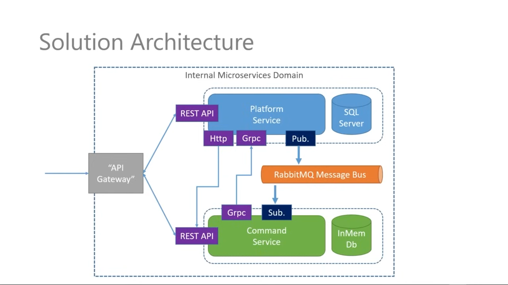
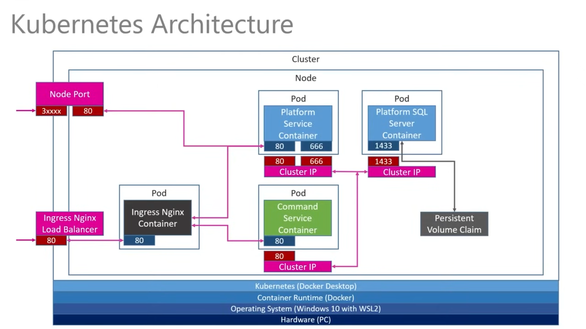

# .NET Microservices
이 문서는 Les Jackson의 유튜브 영상 [.NET Microservices – Full Course](https://www.youtube.com/watch?v=DgVjEo3OGBI)를 학습한 문서입니다.

## Skill
C#, .Net CORE, Docker, Kubernetes, RabbitMQ, gRPC, DB(RDB, In memory)

## Architecture

[기본 ASP.NET Core 포트는 80에서 8080으로 변경되었습니다.](https://learn.microsoft.com/ko-kr/dotnet/core/compatibility/containers/8.0/aspnet-port) 이에 따라 프로젝트에서 80 포트 대신 8080 포트를 사용하였습니다.

## Project Files
- [PlatformService](https://github.com/dtdtdzNetCore/PlatformService)
- [CommandsService](https://github.com/dtdtdzNetCore/CommandsService)
- [Kubernetes-ymal](https://github.com/dtdtdzNetCore/.github/tree/main/profile/K8S)

### Courses
- [1. Introduction and theory](<MarkDown/1. Introduction and theory.md>)
- [2. Building the first service](<MarkDown/2. Building the first service.md>)
- [3. Docker and Kubernetes](<MarkDown/3. Docker and Kubernetes.md>)
- [4. Start our 2nd service](<MarkDown/4. Start our 2nd service.md>)
- [5. Starting with SQL server](<MarkDown/5. Starting with SQL server.md>)
- [6. Multi-Resorce API](<MarkDown/6. Multi-Resorce API.md>)
- [7. Message bus and RabbitMQ](<MarkDown/7. Message bus and RabbitMQ.md>)
- [8. Asychronous messaging](<MarkDown/8. Asychronous messaging.md>)
- [9. gRPC](<MarkDown/9. gRPC.md>)